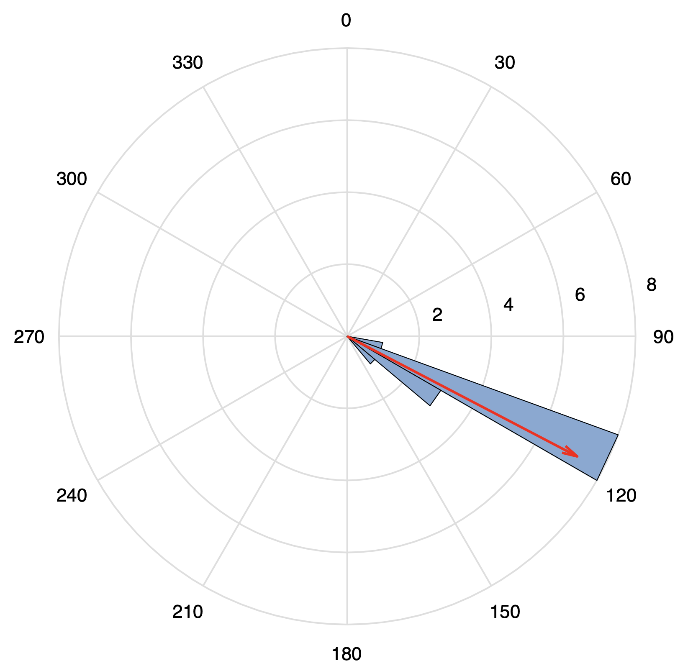

# orient

The `orient` package is a set of codes written in MATLAB, developed for determining the orientation of ocean bottom seismograph (OBS) via Rayleigh-wave polarization.

We determine the orientation based on the method of [Stachnik et al. (2012)](https://doi.org/10.1785/0220110128). 

#### Authors 

[`Le Ba Manh`](https://github.com/bamanhle) & [`Yuechu Wu`](https://github.com/SeisPiano)

#### Cite

If you use `orient` in your work, please cite:
Liu Dan, Yang Ting, Le Ba Manh, Wu Yuechu, Wang Yizhi, Huang Xinfeng, Du Haoran, Wang Jian, Chen Yongshun. (2022). Seismometer-detached broadband ocean bottom seismograph (OBS): development, test, and data quality analysis. Chinese Journal of Geophysics, 65(7): 2560-2572, https://doi.org/10.6038/cjg2022P0441

#### References

- Stachnik, J. C., Sheehan, A. F., Zietlow, D. W., Yang, Z., Collins, J., Ferris, A. (2012) Determination of New Zealand Ocean Bottom Seismometer Orientation via Rayleigh-Wave Polarization. Seismological Research Letters, 83(4): 704–713. https://doi.org/10.1785/0220110128

#### Example results

