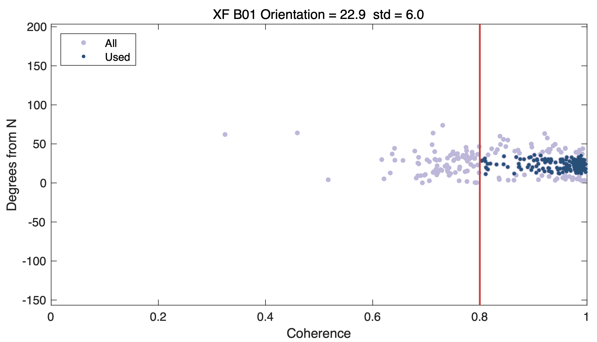

# orient

The `orient` is a package written in MATLAB, developed for determining the orientation of ocean bottom seismograph (OBS) via Rayleigh-wave polarization.

This package calculate the orientation based on the method of [Stachnik et al. (2012)](https://doi.org/10.1785/0220110128). 

### Authors 

[`Ba Manh Le`](https://github.com/bamanhle) & [`Yuechu Wu`](https://github.com/SeisPiano)

### Chinese introduction
[被动源OBS数据处理（3）：确定OBS水平方位角](https://mp.weixin.qq.com/s/KDcqPoe5b0NY-UaKX65WrA)

### Data
- Public seismic data can be downloaded by using package [DownloadSeisData](https://github.com/SeisPiano/DownloadSeisData).
- The user's own data file is also supported. The first 15 digits of the event file name should preferably be yyyymmdd_HHMMSS (e.g., 20120827_043719, represents 2012-08-27T04:37:19). The earthquake event data storage path is shown in the figure below.

### Usage

**Note:** The quality of seismic event data determines the accuracy and error range of the results.

- #### Usage 1 (automatic)
1. Run `orient`, the script will automatically select the event data and calculate the orientation.

- #### Usage 2 (manual)
1. Run `plot_waveform`, the script will roughly select the events and plot the waveforms.
2. Enter the waveform figure folder and delete the figures with poor quality (select events manually).
3. Run `orient_select`, the script will calculate the orientation based on the selected events.

### Example results

- #### Automatically select events

- #### Manually select events

### Cite

If you use `orient` in your work, please cite:

Yuechu Wu, Ting Yang, Min Xu, Dan Liu, Yizhi Wang, Chuanhai Yu, Mei Xue, Weiwei Ding, Baohua Liu. (2024). A passive‐source ocean‐bottom seismic experiment in the South China Sea: Evaluations of data quality and instrument performance. Seismological Research Letters, [https://doi.org/10.1785/0220240224](https://doi.org/10.1785/0220240224)

### References

- Stachnik, J. C., Sheehan, A. F., Zietlow, D. W., Yang, Z., Collins, J., Ferris, A. (2012) Determination of New Zealand Ocean Bottom Seismometer Orientation via Rayleigh-Wave Polarization. Seismological Research Letters, 83(4): 704–713. https://doi.org/10.1785/0220110128
