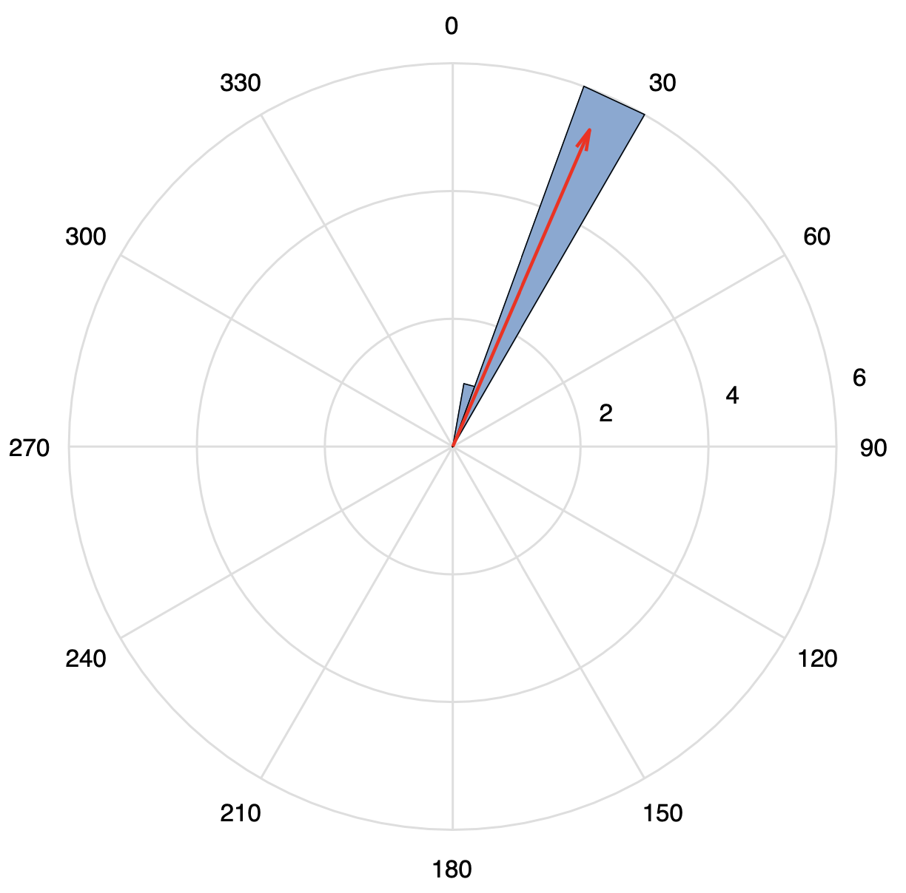

# orient

The `orient` is a package written in MATLAB, developed for determining the orientation of ocean bottom seismograph (OBS) via Rayleigh-wave polarization.

We determine the orientation based on the method of [Stachnik et al. (2012)](https://doi.org/10.1785/0220110128). 

### Authors 

[`Le Ba Manh`](https://github.com/bamanhle) & [`Yuechu Wu`](https://github.com/SeisPiano)

### Usage

**Note:** The quality of seismic data determines the accuracy and error range of the results.

#### Usage 1 (automatic)
1. Run `orient`, the script will automatically select the event data and calculate the orientation.

#### Usage 2 (manual)
1. Run `plot_seismogram`, the script will roughly select the events and plot the waveforms.
2. Enter the seismogram figure folder and delete the figures with poor quality (select events manually).
3. Run `orient_select`, the script will calculate the orientation based on the selected events.

### Example results

#### Automatically select events

#### Manually select events

### Cite

If you use `orient` in your work, please cite:
Liu Dan, Ting Yang, Ba Manh Le, Yuechu Wu, Yizhi Wang, Xinfeng Huang, Haoran Du, Jian Wang, Yongshun Chen. (2022). Seismometer-detached broadband ocean bottom seismograph (OBS): development, test, and data quality analysis. Chinese Journal of Geophysics, 65(7): 2560-2572, https://doi.org/10.6038/cjg2022P0441

### References

- Stachnik, J. C., Sheehan, A. F., Zietlow, D. W., Yang, Z., Collins, J., Ferris, A. (2012) Determination of New Zealand Ocean Bottom Seismometer Orientation via Rayleigh-Wave Polarization. Seismological Research Letters, 83(4): 704–713. https://doi.org/10.1785/0220110128
